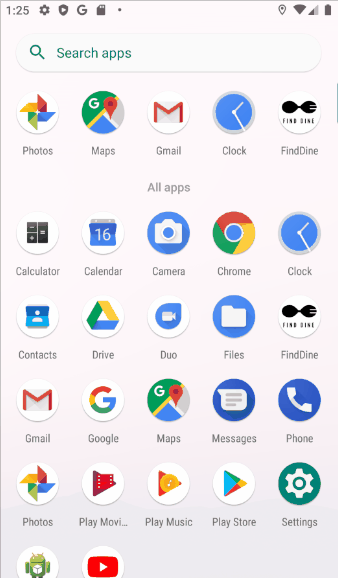
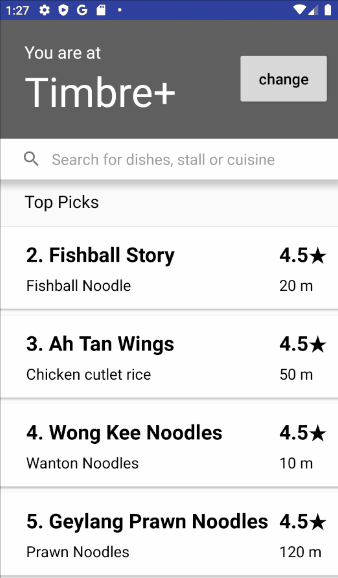

<h2 align="center">
   
  <i>Fine Dining for the Blind</i>
</h2>
 

**Table of Contents**

- [What is this App for?](#what-is-this-app-for)
- [Detection of Access Points with Wi-Fi RTT](#detection-of-access-points-with-wi-fi-rtt)
- [Demo](#demo)
  - [Hardware](#hardware)
  - [Phone App](#phone-app)
- [Setup Requirements](#setup-requirements)
- [Relevant links](#relevant-links)

## What is this App for? 

[Google Presentation Slides](https://docs.google.com/presentation/d/1WX_vkSwrPsl5aPtDbyUSM0wG8FPtu2kj2rrE-b7IxjU/edit#slide=id.g73d1cca60e_0_11)

## Detection of Access Points with Wi-Fi RTT

Wi-Fi RTT was introduced in Android 9 (API level 28). ([link](https://developer.android.com/guide/topics/connectivity/wifi-rtt#implementation_differences_based_on_android_version))
- On devices running Android 9, you need to have access to pre-determined access point (AP) locations data in your app.
- On devices running Android 10 (API level 29) and higher, AP location data can be represented as `ResponderLocation` objects, which include latitude, longitude, and altitude. For Wi-Fi RTT APs that support Location Configuration Information/Location Civic Report (LCI/LCR data), the protocol will return a `ResponderLocation` object during the ranging process. 

`ResponderLocation` is both a Location Configuration Information (LCI) decoder and a Location Civic Report (LCR) decoder for information received from a Wi-Fi Access Point (AP) during Wi-Fi RTT ranging process. ([link](https://developer.android.com/reference/android/net/wifi/rtt/ResponderLocation))
- This is based on the IEEE P802.11-REVmc/D8.0 spec section 9.4.2.22, under Measurement Report Element. Subelement location data-fields parsed from separate input LCI and LCR Information Elements are unified in this class.
- This feature allows apps to query APs to ask them for their position directly rather than needing to store this information ahead of time. So, your app can find APs and determine their positions even if the APs were not known before, such as when a user enters a new building.

> However, as of Jan 2020 when we tried this with Google Nest Wi-Fi, no ResponderObject could be received by the app. So we opted for a different approach.

## Demo

Physical Demo performed during GovTech's HackWeek 2020

[Google Presentation Slides](https://docs.google.com/presentation/d/e/2PACX-1vRGHovOQNHqBLiHItN7GKmQA79n4B04_c2oWkTPXsxzbGFisbAVY9RQeMjRO4T2YHzYjUOYQgT7T9Jr/pub?start=true&loop=false&delayms=10000)

### Hardware

- 1 Nest router
- 4 Nest access points
- 2 Google Pixel 3A'

### Phone App

| Search Feature              | Navigation Instructions         |
| --------------------------- | ------------------------------- |
|  |  |

## Setup Requirements

- **A Phone Device**: The smartphone has to support the ranging standard by hardware. e.g. a Qualcomm Snapdragon 820 CPU
- **Android Version**: Android P installed on the smartphone.
- **Network Protocol Support**: The access point has to support the IEEE 802.11mc FTM standard

## Relevant links
- https://medium.com/@plinzen/perform-wifi-round-trip-time-measurements-with-android-p-9ffc5277ac6a
- https://developer.android.com/guide/topics/connectivity/wifi-rtt#implementation_differences_based_on_android_version
- https://developer.android.com/reference/android/net/wifi/rtt/ResponderLocation